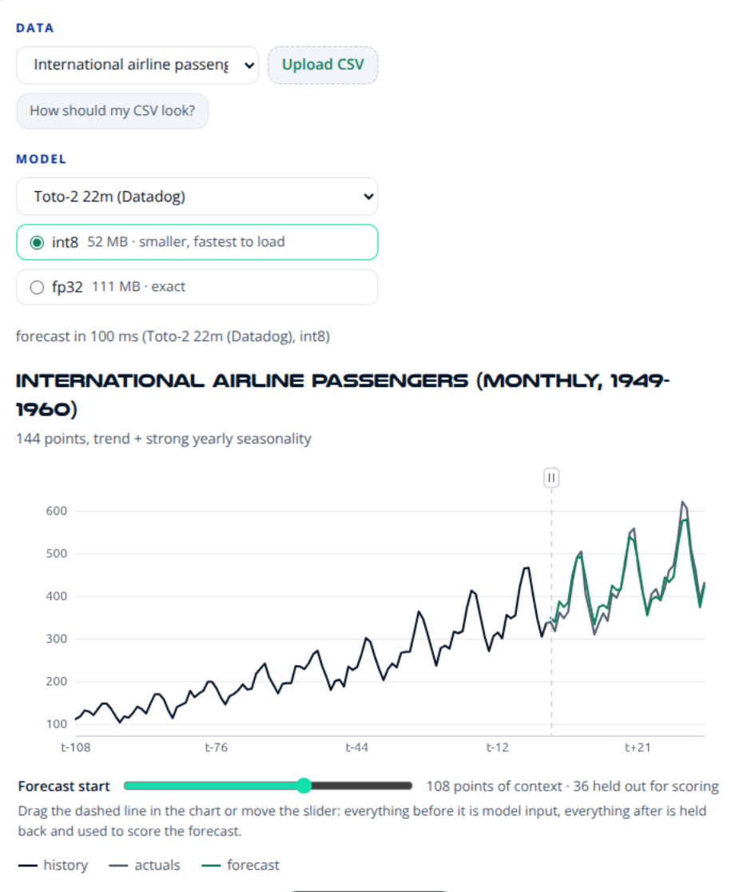
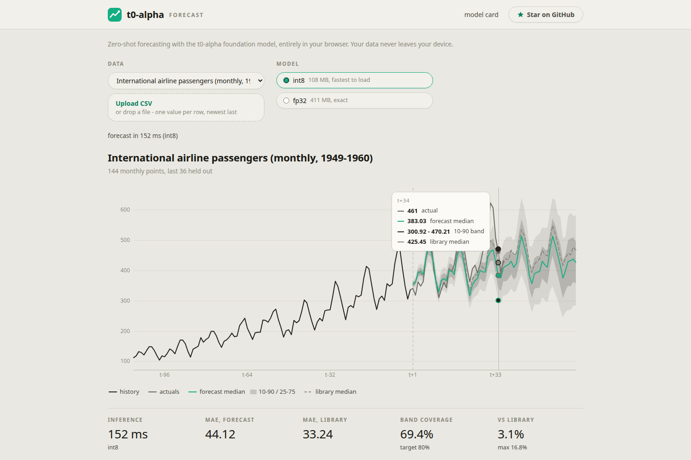
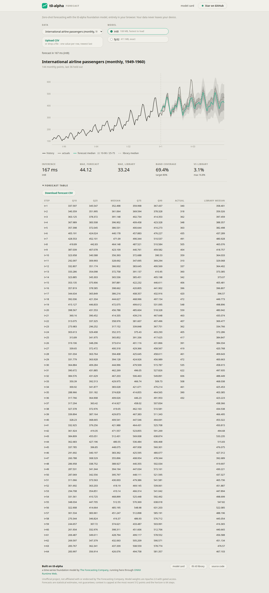
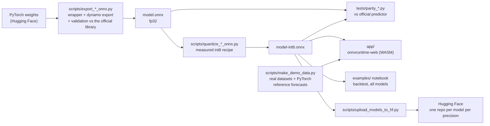

# Forecasting foundation models in the browser

#### do-it-yourself companion to the article "Freeing Forecasting Foundation Models from Artificial Gateway Fees"

#### by [Siddharth](@Siddharth7113) and [Tobias Pitters](@closechoice) ([`sktime`](https://www.sktime.net))

[](LICENSE)
[](https://huggingface.co/sktime)

This project takes five zero-shot time-series foundation models, exports each
one from PyTorch to ONNX with numeric validation against its official
library, quantizes it to int8, and runs it entirely in the browser with
[onnxruntime-web](https://onnxruntime.ai/docs/tutorials/web/).

After an initial model download, **the models run entirely on your computer - no cloud or subscription required!**

This repository also contains a worked case study of exporting custom PyTorch models
to ONNX. Every design decision, failure, and fix is documented, so the same
process can be repeated on other models.

> Note: this is a project by [`sktime`](https://www.sktime.net) - the vendor agnostic, openly governed open source framework for time-series models.
> It is not affiliated with, or endorsed by, any third party model providers, e.g., Amazon.



<details>
<summary>More screenshots: crosshair tooltip and forecast table</summary>





</details>

## The models

| Model | Author | Graph contract | fp32 / int8 size | fp32 parity | int8 parity | ONNX on Hugging Face |
|---|---|---|---|---|---|---|
| [Chronos-2](https://huggingface.co/amazon/chronos-2) | Amazon | `context [B, 2048]` (NaN = missing) + `group_ids [B]` → `quantiles [B, 64, 21]` | 482 MB / 131 MB | 0.0001% | 4.7% | [fp32](https://huggingface.co/sktime/chronos2-onnx), [int8](https://huggingface.co/sktime/chronos2-onnx-int8) |
| [t0-alpha](https://huggingface.co/theforecastingcompany/t0-alpha) | The Forecasting Company | `context [B, 512]` (NaN = missing) → `quantiles [B, 64, 5]` | 412 MB / 108 MB | 0.0001% | mean 3%, max 12 to 18% | [fp32](https://huggingface.co/sktime/t0-alpha-onnx), [int8](https://huggingface.co/sktime/t0-alpha-onnx-int8) |
| [Toto-2.0-22m](https://huggingface.co/Datadog/Toto-2.0-22m) | Datadog | `context [V, 2048]` (NaN = missing) + `series_ids [V]` → `quantiles [V, 96, 9]` | 111 MB / 52 MB | 0.0003% | 2.2% | [fp32](https://huggingface.co/sktime/toto2-22m-onnx), [int8](https://huggingface.co/sktime/toto2-22m-onnx-int8) |
| [TinyCast](https://huggingface.co/raws-labs/tinycast) | RAWS Labs | `context [B, 2048]` (finite) → `quantiles [B, 48, 9]`, one AR block | 2 MB / 2 MB | 0.0003% | 4.1% | [fp32](https://huggingface.co/sktime/tinycast-onnx), [int8](https://huggingface.co/sktime/tinycast-onnx-int8) |
| [TinyTimeMixer r2](https://huggingface.co/ibm-granite/granite-timeseries-ttm-r2) | IBM | `context [B, 512]` (finite) → `forecast [B, 96]`, point forecast | 4 MB / 2 MB | 0.0006% | 6.9% | |

Parity is the maximum difference between the ONNX graph and the official
library's own forecast, as a percentage of the forecast's spread. The fp32
figures are float32 noise. Every int8 model except t0-alpha uses a measured
per-model quantization recipe (see the `scripts/quantize_*_onnx.py` headers);
t0-alpha's is a plain dynamic quantization and is the weakest of the five.

Batch dimensions are dynamic; context length and horizon are baked into each
graph, so other sizes mean re-exporting with `--context-len` and `--horizon`.
Chronos-2 and Toto-2 take a group id per row: rows sharing an id are forecast
jointly as one multivariate system, rows with distinct ids independently.
t0-alpha has an equivalent grouped graph behind `--grouped`.

### Which one to pick

On the airline passengers backtest in
[`examples/ttm_airline_forecast.ipynb`](examples/ttm_airline_forecast.ipynb)
(108 monthly points of context, a 36-month holdout, mean absolute error):

| Model | MAE fp32 | MAE int8 |
|---|---|---|
| Toto-2.0-22m | 18.8 | 18.9 |
| Chronos-2 | 19.9 | 20.7 |
| TinyCast | 27.3 | 26.3 |
| seasonal naive | 35.9 | |
| t0-alpha | 37.4 | 44.1 |
| TinyTimeMixer r2 | 108.5 | 106.0 |

Toto-2 and Chronos-2 are the accurate choices for short seasonal series.
TinyCast and TinyTimeMixer are a few megabytes and a couple of orders of
magnitude faster; TinyTimeMixer needs long, dense, high-frequency history
(512 or more points) and pads short series with zeros, which is why it loses
here. The notebook explains each result.

## Highlights

- **Faithful exports.** Every graph is checked against its official library
  on every export run, and separate parity tests in
  [`tests/`](tests/README.md) repeat the check against the published
  predictors, including TinyCast's autoregressive rollouts and both
  multivariate modes.
- **Browser-sized.** Int8 quantization shrinks the large models roughly four
  times (t0-alpha 412 MB to 108 MB, Chronos-2 482 MB to 131 MB, Toto-2
  111 MB to 52 MB). Each model has its own quantization recipe, chosen by
  measuring which ops could be quantized without hurting the forecast.
- **Fast.** A 64-step probabilistic forecast from t0-alpha takes 80 to 120
  milliseconds under WASM, and the engine's outputs are checked against
  native ONNX Runtime in [tests/](tests/README.md).
- **A complete tool, not just a demo.** The app in [`app/`](app/README.md)
  puts Chronos-2, TinyCast and TinyTimeMixer behind one model picker,
  forecasts your own CSV uploads (multi-column files get a series picker),
  supports backtesting and comparison against uploaded test data, renders a
  quantile-fan chart with a crosshair tooltip, and exports the forecast as a
  table or CSV download. Sample datasets ship with the PyTorch library's own
  forecasts overlaid, so the browser-vs-library difference is measured on
  screen instead of merely being asserted.
- **Multivariate forecasting.** Chronos-2 and Toto-2 graphs take a group id
  per row, and t0-alpha has a grouped variant, so related series (for example
  the temperature, humidity, wind and pressure columns of one climate file)
  can be forecast jointly and inform each other.
- **Teaching materials.** A from-zero [export guide](docs/ONNX_EXPORT_GUIDE.md)
  explains how to export any model, and a [debugging logbook](docs/LOGBOOK.md)
  records every problem that came up along the way, one section per model.

## How it works



Each export script wraps the largest pure-tensor region of the model's
inference path in a fixed-shape module and exports it with the dynamo
exporter. What that region is differs per model, and each script's header
explains the choice:

- **Chronos-2**: `Chronos2Model.forward` is already pure tensor math, so the
  export is nearly direct.
- **t0-alpha**: `predict()` for horizons up to 1024 is one forward pass
  (buffer build, causal scaling, transformer, inverse scaling). The wrapper
  re-implements that pass; data-dependent Python branches are patched out.
- **Toto-2**: `forecast()` for horizons up to the decode block size runs its
  decode loop once with no KV cache; that single pass is the graph.
- **TinyCast**: the published numbers come from an autoregressive predictor
  that runs the backbone in 48-step blocks, so the graph is one block and
  the driver rolls out longer horizons by feeding the median back.
- **TinyTimeMixer**: a point forecaster with its RevIN-style scaler inside
  the model, so the graph takes raw values and emits one value per step.

Series of any length work with the NaN-aware models (t0-alpha, Chronos-2,
Toto-2) because a shorter series is left-padded with NaN, which the model
treats as missing. TinyCast and TinyTimeMixer require finite inputs; their
drivers impute and pad the way their official predictors do.

## Getting started

You will need [uv](https://docs.astral.sh/uv/), a few GB of disk space, and,
for t0-alpha only, access to its gated
[weights](https://huggingface.co/theforecastingcompany/t0-alpha). Request
access on the model page (the default contact-info gate, no extra terms),
then run `uv run hf auth login`.

The models need three Python environments because their libraries pin
conflicting dependency ranges. Each `requirements*.txt` header explains why.

```bash
# t0-alpha, Chronos-2 and TinyCast share one environment (Python 3.12, CPU torch)
uv venv --python 3.12 .venv-export
uv pip install -p .venv-export -r requirements.txt

uv run -p .venv-export python scripts/export_t0_onnx.py             # onnx/t0-alpha-ctx512-h64.onnx
uv run -p .venv-export python scripts/export_t0_onnx.py --grouped   # multivariate variant (-mv)
uv run -p .venv-export python scripts/quantize_t0_onnx.py
uv run -p .venv-export python scripts/export_chronos2_onnx.py
uv run -p .venv-export python scripts/quantize_chronos2_onnx.py
uv run -p .venv-export python scripts/export_tinycast_onnx.py
uv run -p .venv-export python scripts/quantize_tinycast_onnx.py

# TinyTimeMixer r2 (granite-tsfm pins its own transformers range)
uv venv --python 3.12 .venv-ttm
uv pip install -p .venv-ttm --index-strategy unsafe-best-match -r requirements-ttm.txt
uv run -p .venv-ttm python scripts/export_ttm_onnx.py
uv run -p .venv-ttm python scripts/quantize_ttm_onnx.py

# Toto-2.0-22m (toto-models brings gluonts and lightning)
uv venv --python 3.12 .venv-toto
uv pip install -p .venv-toto --index-strategy unsafe-best-match \
    --extra-index-url https://download.pytorch.org/whl/cpu -r requirements-toto.txt
uv run -p .venv-toto python scripts/export_toto2_onnx.py
uv run -p .venv-toto python scripts/quantize_toto2_onnx.py

# Parity against the official predictors
uv run -p .venv-export python tests/parity_onnx_vs_official.py            # Chronos-2
uv run -p .venv-export python tests/parity_tinycast_onnx_vs_official.py
uv run -p .venv-ttm    python tests/parity_ttm_onnx_vs_official.py
uv run -p .venv-toto   python tests/parity_toto2_onnx_vs_official.py

# Sample datasets and PyTorch reference forecasts for the app, then serve it
uv run -p .venv-export python scripts/make_demo_data.py                  # writes app/data/
python -m http.server 8000
# then open http://localhost:8000/app/
```

Every export script validates its graph against the library before it exits,
and every quantize script reports the int8 drift against both the fp32 graph
and the library.

## Use the models from Python

The exported graphs are plain ONNX, so they run anywhere ONNX Runtime does.
They are published on the Hugging Face Hub under the
[sktime](https://huggingface.co/sktime) organization, one repo per model per
precision (`sktime/<model>-onnx` and `sktime/<model>-onnx-int8`, linked in
the table above), so you do not need this repository or the gated t0-alpha
weights to use them. Each repo carries a `manifest.json` with the
machine-readable contract and the file's sha256.

```python
# pip install onnxruntime huggingface_hub numpy
import numpy as np
import onnxruntime as ort
from huggingface_hub import hf_hub_download

path = hf_hub_download("sktime/t0-alpha-onnx", "t0-alpha-ctx512-h64.onnx")
session = ort.InferenceSession(path)

series = np.sin(np.arange(300) / 10) * 10 + 50          # your data here
context = np.full((1, 512), np.nan, dtype=np.float32)   # NaN = missing
context[0, -len(series):] = series[-512:]

(quantiles,) = session.run(None, {"context": context})  # (1, 64, 5)
median = quantiles[0, :, 2]
```

The other four models follow the same pattern with the contracts from the
table above. Chronos-2 and Toto-2 additionally take an int64 id per row
(`group_ids` and `series_ids` respectively); TinyCast needs its median fed
back for horizons beyond 48 steps, and
[`app/js/forecaster.js`](app/js/forecaster.js) shows the reference driver for
each. The notebook in [`examples/`](examples/ttm_airline_forecast.ipynb)
runs all five from Python.

## Hosting the app publicly

The app is static files, so any static host serves it, with one trap: the
model files. GitHub rejects files over 100 MB, so GitHub Pages cannot host
the large int8 models, and most free static hosts have similar caps. The
standard solution is the one transformers.js demos use: put the `.onnx`
files in a Hugging Face model repository (its CDN sends the CORS headers
browsers need) and keep the site itself anywhere.

[`scripts/upload_models_to_hf.py`](scripts/upload_models_to_hf.py) publishes
one repo per model per precision (`<namespace>/<model>-onnx` and
`<namespace>/<model>-onnx-int8`), each with the graph, a model card, a
`manifest.json`, `LICENSE`, and the upstream `NOTICE` where the source ships
one:

```bash
uv run hf auth login                                                # needs a write token
uv run python scripts/upload_models_to_hf.py <you> --precision both  # all models
uv run python scripts/upload_models_to_hf.py <you> --models t0 chronos2
```

The sktime repos were published this way. Deploying the site is then:

1. Point `MODEL_BASE` in [`app/js/config.js`](app/js/config.js) at the repo
   that holds the files the registry lists (it still carries a `CHANGE-ME`
   placeholder).
2. Push this repository to GitHub.
3. Serve the `app/` folder on any static host (GitHub Pages, Cloudflare
   Pages, Netlify). For GitHub Pages, publish the repo and set Pages to
   serve from the `app/` directory (or a workflow that copies it).

All five upstream models are Apache-2.0, so converted redistribution with
attribution is permitted; keep the credit in the app footer and the model
cards. t0-alpha's weights are gated, which is a contact-information gate on
top of the license rather than a licensing restriction, and its `NOTICE`
file must travel with any redistribution.

## Repository layout

| Path | What it is |
|---|---|
| [`scripts/export_t0_onnx.py`](scripts/export_t0_onnx.py) | Exports t0-alpha to ONNX with strict numeric validation. The comments explain the export boundary, the shape decisions, and every monkeypatch. `--grouped` builds the multivariate variant. |
| [`scripts/export_chronos2_onnx.py`](scripts/export_chronos2_onnx.py) | Exports Chronos-2 with its `group_ids` input. |
| [`scripts/export_toto2_onnx.py`](scripts/export_toto2_onnx.py) | Exports Toto-2.0-22m's single-pass decode with its `series_ids` input. |
| [`scripts/export_tinycast_onnx.py`](scripts/export_tinycast_onnx.py) | Exports one 48-step TinyCast block; the library is vendored at [`tinycast/`](tinycast/). |
| [`scripts/export_ttm_onnx.py`](scripts/export_ttm_onnx.py) | Exports TinyTimeMixer r2 as a point forecaster. |
| `scripts/quantize_*_onnx.py` | One per model: the measured int8 recipe, with the accuracy drift reported against fp32 and the library. |
| [`scripts/upload_models_to_hf.py`](scripts/upload_models_to_hf.py) | Publishes the exports to Hugging Face, one repo per model per precision, with card, manifest, LICENSE and NOTICE. |
| [`scripts/inspect_onnx.py`](scripts/inspect_onnx.py) | A CLI for looking inside any `.onnx` file, with op histograms, per-node dtype and shape dumps, and a three-gate `--check`. |
| [`scripts/make_demo_data.py`](scripts/make_demo_data.py) | Downloads the demo datasets and precomputes the library's reference forecasts. |
| `requirements.txt`, `requirements-ttm.txt`, `requirements-toto.txt` | The three export environments and why they cannot be one. |
| [`app/`](app/README.md) | The browser tool, written as vanilla ES modules with no build step. Its [README](app/README.md) documents the architecture and the no-framework decision. |
| [`tests/`](tests/README.md) | Parity tests against each official predictor, plus Node-based regression tests that run the graphs under onnxruntime-web's WASM kernels. |
| [`examples/ttm_airline_forecast.ipynb`](examples/ttm_airline_forecast.ipynb) | Backtests all five models, fp32 and int8, on the airline series with plotly charts. |
| [`examples/predict_pytorch.py`](examples/predict_pytorch.py) | The original t0-alpha PyTorch quickstart from its model card. |
| [`docs/ONNX_EXPORT_GUIDE.md`](docs/ONNX_EXPORT_GUIDE.md) | Explains how to export any PyTorch model to ONNX, assuming no prior ONNX knowledge. |
| [`docs/LOGBOOK.md`](docs/LOGBOOK.md) | A chronological journal of every problem each conversion hit, with the symptom, the diagnosis, the fix, and the lesson. |

## Measured results

The parity columns in the model table above are the headline numbers. The
following were measured on the t0-alpha deployment specifically:

| Check | Result |
|---|---|
| ONNX (fp32) vs `model.predict()` on identical input | max abs diff about 2e-05 |
| int8 vs fp32 forecast drift | mean about 3%, max 12 to 18% of forecast spread depending on the series |
| onnxruntime-web (WASM) vs native ONNX Runtime | at most 1.5e-05 |
| Inference latency (WASM, single thread) | 80 to 120 ms per forecast |
| NaN padding vs a natural short-series call | about 11% of spread (airline, 108 points) |
| 512-point context budget vs full history | 12% (temperatures) to 55% (sunspots, whose 11-year cycle wants a longer `--context-len`) |

The last two rows measure properties of the fixed-shape deployment rather
than export error, which is why the demo reports them separately.

### t0-alpha quantization drift by dataset

Because dynamic int8 quantization interacts with the data, the drift varies
by series. The table below compares each t0-alpha ONNX model against the
library's forecast on the identical padded input, and reports the mean and
maximum absolute difference as a percentage of that forecast's spread.

| Dataset | fp32 mean / max | int8 mean / max |
|---|---|---|
| Airline passengers (144 points, padded) | 0.00% / 0.00% | 3.07% / 16.79% |
| Melbourne daily min temperatures | 0.00% / 0.00% | 0.94% / 7.35% |
| Monthly sunspots | 0.00% / 0.00% | 0.96% / 7.31% |

The fp32 export is numerically exact for practical purposes on every
dataset. The int8 model stays around 1% mean drift on long, well-behaved
series, but it degrades noticeably on the short, strongly trending airline
series, whose padded context gives the quantized MatMuls less signal to
work with. If your series are short or the tails of the quantile fan
matter, prefer the fp32 model.

## Limitations

- Covariates are not exported for any model (known future inputs such as
  calendar features), although the export guide explains how you would add
  them. Multivariate targets are supported through the grouped graphs.
- Each graph has one fixed context length, so series with long memory, such
  as sunspots, benefit from re-exporting with a larger `--context-len`.
- Horizons beyond a model's single-pass limit (1024 steps for t0-alpha, the
  decode block for Toto-2) would require the library's autoregressive
  rollout, which lives outside the graph. TinyCast is the exception: its
  rollout is the intended driver and lives in JavaScript.
- Toto-2's int8 graph uses opset-21 blocked quantization, which needs
  onnxruntime 1.20 or newer and has not been tested under onnxruntime-web.
- The browser app currently exposes Chronos-2, TinyCast and TinyTimeMixer.
  t0-alpha and Toto-2 run from Python and the notebook.

## Attribution

- **Chronos-2** and the [chronos-forecasting](https://github.com/amazon-science/chronos-forecasting)
  library are by **Amazon**, Apache-2.0.
  - **t0-alpha** and the [tfc-t0](https://github.com/theforecastingcompany/tfc-t0)
  library are built by **The Forecasting Company** and released under
  Apache-2.0, with the weights gated on Hugging Face. The export script
  contains export-safe adaptations of several tfc-t0 inference functions,
  which are listed in [NOTICE](NOTICE). According to tfc-t0's source headers,
  parts of the architecture derive from Toto and Chronos.
- **TinyCast** and its [library](https://github.com/raws-labs/tinycast) are
  by **RAWS Labs**, Apache-2.0. The library is vendored at
  [`tinycast/`](tinycast/) for a reproducible export.
- **TinyTimeMixer r2** and the [granite-tsfm](https://github.com/ibm-granite/granite-tsfm)
  library are by **IBM**, Apache-2.0.
- **Toto-2.0-22m** and the [toto](https://github.com/DataDog/toto) library
  are by **Datadog**, Apache-2.0.
- **Datasets**: the Box and Jenkins airline passengers series, the Melbourne
  daily minimum temperatures from the Australian Bureau of Meteorology, and
  the monthly sunspot counts from SIDC at the Royal Observatory of Belgium,
  all fetched via [jbrownlee/Datasets](https://github.com/jbrownlee/Datasets).
- **Runtime**: [ONNX Runtime](https://onnxruntime.ai) by Microsoft, MIT
  licensed.
- **AI use**: Claude Fable 5 was used in different parts of the project.

## License

The code in this repository is licensed under [Apache-2.0](LICENSE).
No model weights are included, redistributed, or relicensed in this repository.
Licenses of used/imported weights from Hugging Face are as per the licenses there.
