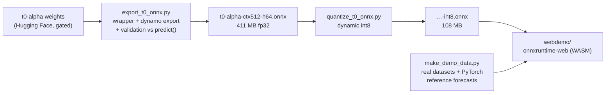

# t0-alpha in the browser

**Client-side time-series forecasting**: [The Forecasting Company](https://theforecastingcompany.com)'s
[t0-alpha](https://huggingface.co/theforecastingcompany/t0-alpha) foundation
model, exported from PyTorch to ONNX and running entirely in the browser via
[onnxruntime-web](https://onnxruntime.ai/docs/tutorials/web/) — no server, no
Python, forecasts in ~100 ms.

This is also a **worked, documented case study of exporting a custom PyTorch
model to ONNX**: every design decision, failure, and fix is written up so you
can repeat the process on other models.

> ⚠️ Unofficial community project — not affiliated with or endorsed by
> The Forecasting Company.

## Highlights

- ✅ **Faithful export** — the ONNX graph matches the library's
  `model.predict()` to `1.7e-05` (fp32), verified against the original
  implementation on every run of the export script.
- 📦 **Browser-sized** — int8 quantization shrinks 411 MB → **108 MB**
  (mean drift ≈ 3.3% of forecast spread; the fp32 model is one radio button
  away when fidelity matters).
- ⚡ **Fast** — ~80–120 ms per 64-step probabilistic forecast under WASM,
  verified against native ONNX Runtime to ~1e-5 in [tests/](tests/README.md).
- 📊 **Honest demo** — forecasts real classic datasets (airline passengers,
  Melbourne temperatures, sunspots) *with the PyTorch library's own
  forecasts overlaid*, so the browser-vs-library difference is measured on
  screen, not asserted. CSV upload included.
- 📚 **Teaching materials** — a from-zero [export guide](ONNX_EXPORT_GUIDE.md)
  and a [debugging logbook](LOGBOOK.md) of every problem hit along the way.

## How it works



The exported graph is one fixed-shape forward pass:

```
input   context    float32 [batch, 512]    NaN = missing value
output  quantiles  float32 [batch, 64, 5]  levels [0.1, 0.25, 0.5, 0.75, 0.9]
```

Variable-length series work because t0-alpha natively treats NaN as
"missing": shorter series are left-padded with NaN — a valid model input,
not an approximation. Batch is dynamic; context length and horizon are
baked in (re-export with `--context-len/--horizon` for other variants).

## Getting started

**Prerequisites**: [uv](https://docs.astral.sh/uv/) (or plain pip),
~1.5 GB disk, and access to the gated
[t0-alpha weights](https://huggingface.co/theforecastingcompany/t0-alpha)
(request access on the model page, then `hf auth login`).

```bash
# 1. Export environment (Python 3.12 + CPU torch, matching tfc-t0's support window)
uv venv --python 3.12 .venv-export
uv pip install -p .venv-export torch --index-url https://download.pytorch.org/whl/cpu
uv pip install -p .venv-export tfc-t0 onnx onnxscript onnxruntime

# 2. Export + validate against the original library
.venv-export/bin/python export_t0_onnx.py          # -> onnx/t0-alpha-ctx512-h64.onnx

# 3. Quantize for the web
.venv-export/bin/python quantize_t0_onnx.py        # -> onnx/...-int8.onnx

# 4. Demo datasets + PyTorch reference forecasts
.venv-export/bin/python make_demo_data.py          # -> webdemo/data/

# 5. Serve and open
python -m http.server 8000                          # from the repo root
# -> http://localhost:8000/webdemo/
```

## Repository layout

| Path | What it is |
|---|---|
| [`export_t0_onnx.py`](export_t0_onnx.py) | PyTorch → ONNX export with strict numeric validation; extensively commented (export boundary, fixed-vs-dynamic shapes, every monkeypatch) |
| [`quantize_t0_onnx.py`](quantize_t0_onnx.py) | int8 dynamic quantization + accuracy-drift report |
| [`inspect_onnx.py`](inspect_onnx.py) | CLI to look inside any `.onnx`: op histograms, per-node dtype/shape dumps, three-gate `--check` |
| [`make_demo_data.py`](make_demo_data.py) | downloads the demo datasets and precomputes library reference forecasts |
| [`webdemo/`](webdemo/README.md) | the browser app — vanilla ES modules, no build step ([architecture](webdemo/README.md)) |
| [`tests/`](tests/README.md) | Node-based regression test of both models under onnxruntime-web's WASM kernels |
| [`ONNX_EXPORT_GUIDE.md`](ONNX_EXPORT_GUIDE.md) | how to export **any** PyTorch model to ONNX, assuming zero ONNX knowledge |
| [`LOGBOOK.md`](LOGBOOK.md) | chronological journal of every problem this conversion hit: symptom → diagnosis → fix → lesson |
| [`unvariate_t0.py`](unvariate_t0.py) | the original PyTorch quickstart from the model card |

## Measured results

| Check | Result |
|---|---|
| ONNX (fp32) vs `model.predict()`, identical input | max abs diff **1.7e-05** |
| int8 vs fp32 forecast drift | mean **≈ 3.3%**, max ≈ 12% of forecast spread |
| onnxruntime-web (WASM) vs native ONNX Runtime | ≤ **1.5e-05** |
| Inference latency (WASM, single thread) | **~80–120 ms** per forecast |
| NaN-padding vs natural short-series call | ≈ 11% of spread (airline, 108 pts) |
| 512-point context budget vs full history | 12% (temperatures) – 55% (sunspots: the ~11-year cycle wants a longer `--context-len`) |

The last two rows are properties of the fixed-shape deployment, not export
error — the demo reports them separately for exactly that reason.

## Limitations

- Univariate forecasting only; the library's future-covariates path is not
  exported (see `ONNX_EXPORT_GUIDE.md` §4 for how you would).
- One fixed context length per graph (512 here). Long-memory series
  (e.g. sunspots) benefit from re-exporting with a larger `--context-len`.
- Horizons beyond 1024 steps would need the library's autoregressive
  rollout, which lives outside the single-pass graph.

## Attribution

- **Model & library**: [t0-alpha](https://huggingface.co/theforecastingcompany/t0-alpha)
  and [tfc-t0](https://github.com/theforecastingcompany/tfc-t0) by
  **The Forecasting Company**, Apache-2.0, weights gated on Hugging Face.
  `export_t0_onnx.py` contains export-safe adaptations of several tfc-t0
  inference functions (see [NOTICE](NOTICE)).
- **Architecture heritage** (per tfc-t0's source headers):
  [Toto](https://github.com/DataDog/toto) (Datadog) and
  [Chronos](https://github.com/amazon-science/chronos-forecasting) (Amazon
  Science), both Apache-2.0.
- **Datasets**: Box & Jenkins airline passengers; Melbourne daily minimum
  temperatures (Australian Bureau of Meteorology); monthly sunspots (SIDC,
  Royal Observatory of Belgium) — via
  [jbrownlee/Datasets](https://github.com/jbrownlee/Datasets).
- **Runtime**: [ONNX Runtime](https://onnxruntime.ai) (Microsoft, MIT).

## License

[Apache-2.0](LICENSE) for the code in this repository (see
[NOTICE](NOTICE)). The t0-alpha **model weights are not included** — they
are distributed by The Forecasting Company under their own terms and gated
access on Hugging Face.
