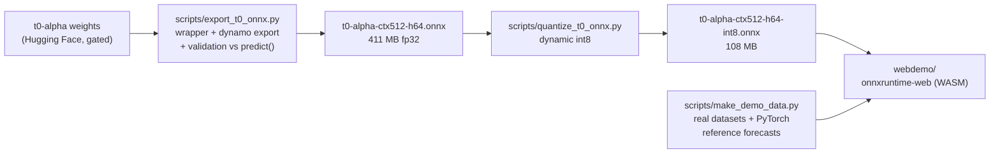

# t0-alpha in the browser

###  Used Claude Fable 5 in different parts of the project.

This project takes [The Forecasting Company](https://theforecastingcompany.com)'s
[t0-alpha](https://huggingface.co/theforecastingcompany/t0-alpha) time-series
foundation model, exports it from PyTorch to ONNX, and runs it entirely in the
browser with [onnxruntime-web](https://onnxruntime.ai/docs/tutorials/web/).
There is no server and no Python at inference time, and a full probabilistic
forecast takes about 100 milliseconds.

The repository is also a worked case study of exporting a custom PyTorch model
to ONNX. Every design decision, failure, and fix is documented, so the same
process can be repeated on other models.

> Note: this is an unofficial project that is not affiliated with or endorsed
> by The Forecasting Company.

## Highlights

- **Faithful export.** The ONNX graph matches the library's `model.predict()`
  to a maximum difference of 1.7e-05 in float32, and the export script checks
  this against the original implementation on every run.
- **Browser-sized.** Int8 quantization shrinks the model from 411 MB to
  108 MB, at the cost of a mean drift of about 3.3% of the forecast spread.
  When fidelity matters more than download size, the demo can switch to the
  fp32 model with one radio button.
- **Fast.** A 64-step probabilistic forecast takes 80 to 120 milliseconds
  under WASM, and the engine's outputs are checked against native ONNX
  Runtime in [tests/](tests/README.md).
- **An honest demo.** The demo forecasts real classic datasets (airline
  passengers, Melbourne temperatures, and sunspots) while overlaying the
  PyTorch library's own forecasts, so the difference between the browser and
  the library is measured on screen instead of merely being asserted. You can
  also upload your own CSV files.
- **Teaching materials.** A from-zero [export guide](docs/ONNX_EXPORT_GUIDE.md)
  explains how to export any model, and a [debugging logbook](docs/LOGBOOK.md)
  records every problem that came up along the way.

## How it works



The exported graph is a single fixed-shape forward pass:

```
input   context    float32 [batch, 512]    NaN = missing value
output  quantiles  float32 [batch, 64, 5]  levels [0.1, 0.25, 0.5, 0.75, 0.9]
```

Series of any length work because t0-alpha treats NaN as a missing value,
which it was trained to handle. A shorter series is therefore left-padded
with NaN, and the padded series is a valid model input rather than an
approximation. The batch dimension is dynamic, while the context length and
the horizon are baked into the graph, so if you need other sizes you
re-export with `--context-len` and `--horizon`.

## Getting started

You will need [uv](https://docs.astral.sh/uv/) or plain pip, about 1.5 GB of
disk space, and access to the gated
[t0-alpha weights](https://huggingface.co/theforecastingcompany/t0-alpha).
Request access on the model page, then run `hf auth login`.

```bash
# 1. Create the export environment (Python 3.12 with CPU torch, matching tfc-t0's support window)
uv venv --python 3.12 .venv-export
uv pip install -p .venv-export torch --index-url https://download.pytorch.org/whl/cpu
uv pip install -p .venv-export tfc-t0 onnx onnxscript onnxruntime

# 2. Activate it for the rest of the session
source .venv-export/bin/activate

# 3. Export the model and validate it against the original library
python scripts/export_t0_onnx.py       # writes onnx/t0-alpha-ctx512-h64.onnx

# 4. Quantize it for the web
python scripts/quantize_t0_onnx.py     # writes onnx/t0-alpha-ctx512-h64-int8.onnx

# 5. Prepare the demo datasets and the PyTorch reference forecasts
python scripts/make_demo_data.py       # writes webdemo/data/

# 6. Serve the repo root and open the demo
python -m http.server 8000
# then open http://localhost:8000/webdemo/
```

## Repository layout

| Path | What it is |
|---|---|
| [`scripts/export_t0_onnx.py`](scripts/export_t0_onnx.py) | Exports PyTorch to ONNX with strict numeric validation. The comments explain the export boundary, the shape decisions, and every monkeypatch. |
| [`scripts/quantize_t0_onnx.py`](scripts/quantize_t0_onnx.py) | Performs int8 dynamic quantization and reports the accuracy drift. |
| [`scripts/inspect_onnx.py`](scripts/inspect_onnx.py) | A CLI for looking inside any `.onnx` file, with op histograms, per-node dtype and shape dumps, and a three-gate `--check`. |
| [`scripts/make_demo_data.py`](scripts/make_demo_data.py) | Downloads the demo datasets and precomputes the library's reference forecasts. |
| [`webdemo/`](webdemo/README.md) | The browser app, written as vanilla ES modules with no build step. Its [README](webdemo/README.md) documents the architecture. |
| [`tests/`](tests/README.md) | Node-based regression tests that run both models under onnxruntime-web's WASM kernels. |
| [`docs/ONNX_EXPORT_GUIDE.md`](docs/ONNX_EXPORT_GUIDE.md) | Explains how to export any PyTorch model to ONNX, assuming no prior ONNX knowledge. |
| [`docs/LOGBOOK.md`](docs/LOGBOOK.md) | A chronological journal of every problem this conversion hit, with the symptom, the diagnosis, the fix, and the lesson for each. |
| [`examples/predict_pytorch.py`](examples/predict_pytorch.py) | The original PyTorch quickstart from the model card. |

## Measured results

| Check | Result |
|---|---|
| ONNX (fp32) vs `model.predict()` on identical input | max abs diff 1.7e-05 |
| int8 vs fp32 forecast drift | mean about 3.3%, max about 12% of forecast spread |
| onnxruntime-web (WASM) vs native ONNX Runtime | at most 1.5e-05 |
| Inference latency (WASM, single thread) | 80 to 120 ms per forecast |
| NaN padding vs a natural short-series call | about 11% of spread (airline, 108 points) |
| 512-point context budget vs full history | 12% (temperatures) to 55% (sunspots, whose 11-year cycle wants a longer `--context-len`) |

The last two rows measure properties of the fixed-shape deployment rather
than export error, which is why the demo reports them separately.

### Quantization drift by dataset

Because dynamic int8 quantization interacts with the data, the drift varies
by series. The table below compares each ONNX model against the library's
forecast on the identical padded input, and reports the mean and maximum
absolute difference as a percentage of that forecast's spread.

| Dataset | fp32 mean / max | int8 mean / max |
|---|---|---|
| Airline passengers (144 points, padded) | 0.00% / 0.00% | 3.07% / 16.79% |
| Melbourne daily min temperatures | 0.00% / 0.00% | 0.94% / 7.35% |
| Monthly sunspots | 0.00% / 0.00% | 0.96% / 7.31% |

The fp32 export is numerically exact for practical purposes on every
dataset. The int8 model stays around 1% mean drift on long, well-behaved
series, but it degrades noticeably on the short, strongly trending airline
series, whose padded context gives the quantized MatMuls less signal to
work with. If your series are short or the tails of the quantile fan
matter, prefer the fp32 model.

## Limitations

- Only univariate forecasting is exported. The library's future-covariates
  path is not included, although the export guide explains how you would add
  it.
- Each graph has one fixed context length, 512 in this case, so series with
  long memory, such as sunspots, benefit from re-exporting with a larger
  `--context-len`.
- Horizons beyond 1024 steps would require the library's autoregressive
  rollout, which lives outside the single-pass graph.

## Attribution

- **Model and library**: [t0-alpha](https://huggingface.co/theforecastingcompany/t0-alpha)
  and [tfc-t0](https://github.com/theforecastingcompany/tfc-t0) are built by
  **The Forecasting Company** and released under Apache-2.0, with the weights
  gated on Hugging Face. The export script contains export-safe adaptations
  of several tfc-t0 inference functions, which are listed in [NOTICE](NOTICE).
- **Architecture heritage**: according to tfc-t0's source headers, parts of
  the architecture derive from [Toto](https://github.com/DataDog/toto) by
  Datadog and [Chronos](https://github.com/amazon-science/chronos-forecasting)
  by Amazon Science, both Apache-2.0.
- **Datasets**: the Box and Jenkins airline passengers series, the Melbourne
  daily minimum temperatures from the Australian Bureau of Meteorology, and
  the monthly sunspot counts from SIDC at the Royal Observatory of Belgium,
  all fetched via [jbrownlee/Datasets](https://github.com/jbrownlee/Datasets).
- **Runtime**: [ONNX Runtime](https://onnxruntime.ai) by Microsoft, MIT
  licensed.

## License

The code in this repository is licensed under [Apache-2.0](LICENSE); see
[NOTICE](NOTICE) for attribution details. The t0-alpha model weights are not
included, since The Forecasting Company distributes them under their own
terms and gated access on Hugging Face.
